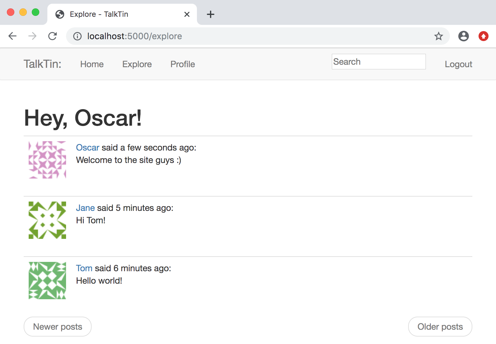

# Microblog Flask Web App

This is a web app built with Python and Flask from the ground up by following Miguel Grinberg's phenomenal [tutorial](https://blog.miguelgrinberg.com/post/the-flask-mega-tutorial-part-i-hello-world). Anyone interested in learning about full stack web development will find the resources he provides truly invaluable. 

The app itself is a microblog which allows users to make accounts, login, post messages, and follow posts by other users. There is also an automatic post translation service (as of yet incomplete) and a post text search feature implemented with [Elasticsearch](https://www.elastic.co/products/elasticsearch).

<p align="center"></p>

The app makes use of a variety of useful Flask extensions including Flask-Bootstrap, Flask-Login, Flask-Moment, Flask-WTF, as well as Flask-SQLAlchemy and Flask-Migrate for interfacing with and managing a relational database on the backend. Frontend styling is acheived with Bootstrap. 

The app can be deployed in a number of different ways as outlined below. By far the easiest is the third option which uses [docker-compose](https://docs.docker.com/compose/). This reads the container configurations from the `docker-compose.yml` file and automatically sets up the whole application, creating and running all of the necessary containers and networking them together. 

-----------

To manually run and host locally:

Choose a secret key and place it in the `.env` file. This should be a long random string that only you know.
```
$ conda create -n mb_flask_env python=3.7 pip
$ source activate mb_flask_env
$ pip install -r requirements.txt
$ export FLASK_APP=microblog.py
$ flask db update
$ flask run
```
The app will be available to view in a browswer at: `localhost:5000/`

In order for the text search feature to work you need Elasticsearch installed and running, available on http://localhost:9200

To include this feature run:
```
$ export ELASTICSEARCH_URL=http://localhost:9200
```

-----------

To run with docker:
```
$ docker build -t microblog:latest .
$ docker network create my_net
$ docker run --name mysql --network my_net -d -e MYSQL_RANDOM_ROOT_PASSWORD=yes -e MYSQL_DATABASE=microblog -e MYSQL_USER=ofb -e MYSQL_PASSWORD=<choose-a-password> mysql/mysql-server:5.7
$ docker run --name elasticsearch --network my_net --rm -d -e "discovery.type=single-node" docker.elastic.co/elasticsearch/elasticsearch:6.8.6
$ docker run --name microblog --network my_net -d -p 8000:5000 --rm -e SECRET_KEY=my-secret-key -e DATABASE_URL=mysql+pymysql://ofb:<choose-a-password>@mysql:3306/microblog -e ELASTICSEARCH_URL=http://elasticsearch:9200 microblog:latest
```

Replace `choose-a-password` (both appearances) with a password for the mysql database and replace `my-secret-key` with a long random string that only you know.

The app will be available to view in a browswer at: `localhost:8000/`

-----------

To run with docker-compose (easiest):
```
$ export SECRET_KEY=<choose-secret-key>
$ export MYSQL_PASSWORD=<choose-mysql-password>
$ docker-compose up
```

The app will be available to view in a browswer at: `localhost:8000/`

To gracefully stop the app after this simply type: `docker-compose down`
